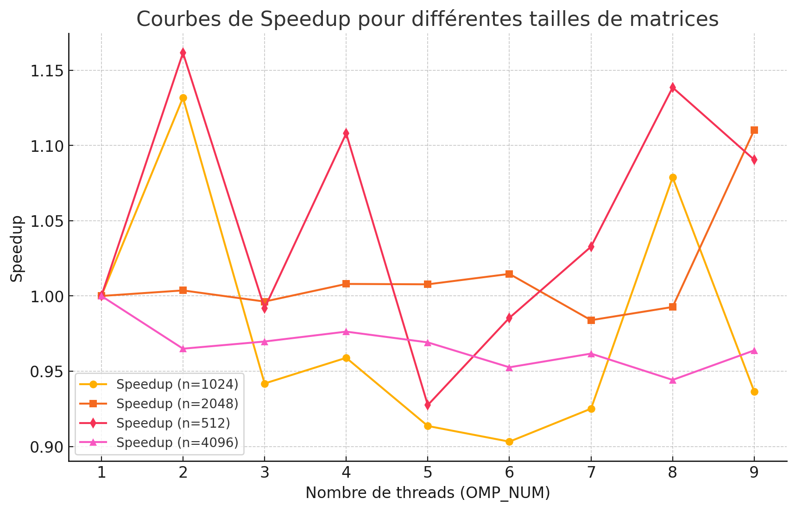
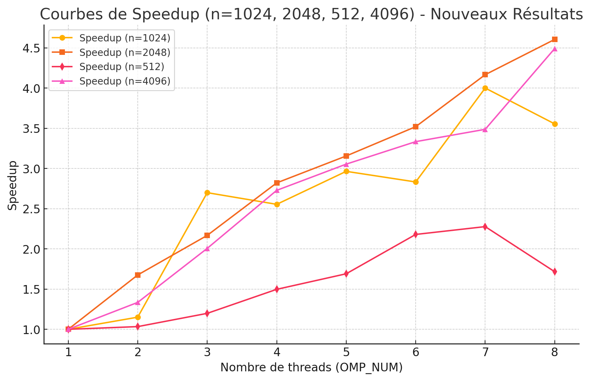
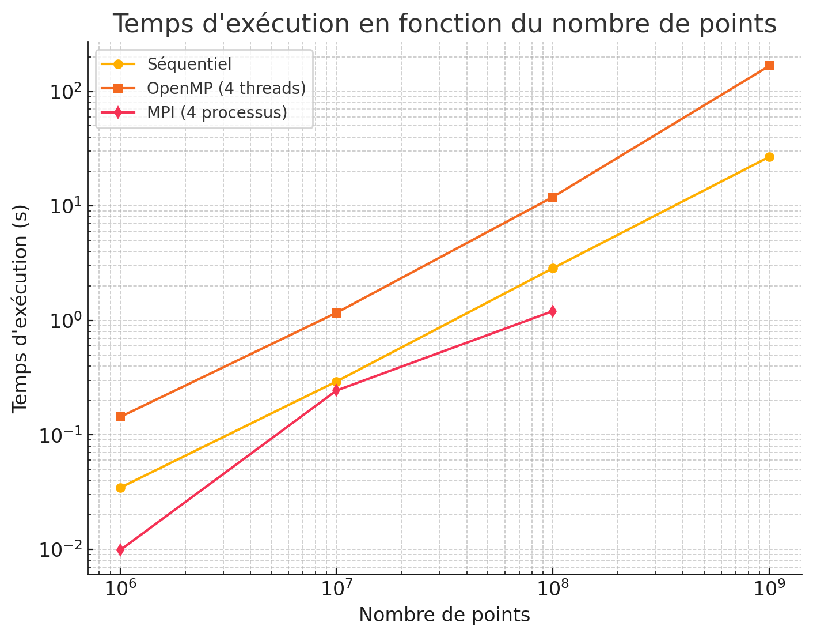

Hippolyte PAILLER

# TD1 : Partie 1

`pandoc -s --toc README.md --css=./github-pandoc.css -o README.html`

## lscpu

*lscpu donne des infos utiles sur le processeur : nb core, taille de cache :*

 Model name:             Intel(R) Core(TM) i7-10510U CPU @ 1.80GHz
    CPU family:           6
    Model:                142
    Thread(s) per core:   2
    Core(s) per socket:   4
    Socket(s):            1
    Stepping:             12

Thread(s) per core : 2
Chaque cœur du processeur peut exécuter deux threads simultanément grâce à l'Hyper-Threading, ce qui améliore les performances dans les tâches parallèles.
Core(s) per socket : 4
Le processeur possède 4 cœurs physiques, chacun capable de traiter des instructions indépendantes.
Socket(s) : 1
Cela signifie que votre ordinateur dispose d'un seul processeur (socket).


## Produit matrice-matrice

### Effet de la taille de la matrice

  n            | MFlops
---------------|--------
1023           |113.915  (18.79)
1024           |72.8781  (29.46)
1025           |110.738  (19.44)
1026           |120.775  (17.86)
               

Les matrices sont stockées en mémoire en ligne (row-major order), mais si l’algorithme accède aux colonnes plutôt qu’aux lignes, cela entraîne de nombreux cache misses, ralentissant les calculs.
Si l'algorithme n'exploite pas toutes les ressources de l'ordinateur (comme les cœurs multiples d'un processeur), le calcul est séquentiel et donc lent.
Solution : - Réorganiser les calculs pour maximiser la localité des données
1024 est censé être vraiment plus long que les deux autres (pas compréhensible sur mon ordi)

### Permutation des boucles

*Expliquer comment est compilé le code (ligne de make ou de gcc) : on aura besoin de savoir l'optim, les paramètres, etc. Par exemple :*

`make TestProduct.exe && ./TestProduct.exe 1024`


  ordre           | time    | MFlops  | MFlops(n=2048)
------------------|---------|---------|----------------
i,j,k (origine)   | 24.98   | 85.94   |
j,i,k             | 7.58055 | 283.289 |
i,k,j             | 26.28   | 81.68   |
k,i,j             | 25.6775 | 83.6328 |
j,k,i             | 1.01937 | 2106.68 |1896.42(9s)
k,j,i             | 1.09636 | 1958.74 |1759.6 (9.76349)


On se place dans le pire cas, où à chaque changement de ligne le cache de la ligne précédente est supprimé, et soit une matrice carrée de taille n. Avec l'ordre (j,k,i), j est modifié n fois, k n² fois et i n³ fois. Or, quand i change il suffit de lire dans le cache la valeur, quand k change il faire une mise en cache, et quand k change il faut faire deux mises en cache (sans compter d'éventuelles mises en cache si n est plus grand que le cache, car il y en aura autant pour les trois variables). Cet ordre permet donc de minimiser le nombre de mises en cache.
--> cela permet d'exploiter des blocs mémoires continus et donc d'améliorer la vitesse de calcul


### OMP sur la meilleure boucle
Il fallait mettre :#pragma omp parallel for (pour permettre la parallélisation !)

``

  OMP_NUM         | MFlops  | MFlops(n=2048) | MFlops(n=512)  | MFlops(n=4096)
------------------|---------|----------------|----------------|---------------
1                 |1930.77  |1898.3          |2334.6          |1807.47
2                 |2221.94  |3181.38         |2412.47         |2412.47
3                 |5212.52  |4115.6          |2797.5          |3626.97
4                 |4932.16  |5355.76         |3495.36         |4932.05
5                 |5724.39  |5991.23         |3947.04         |5521.13
6                 |5469.47  |6682.94         |5089.48         |6026.62
7                 |7725.19  |7910.59         |5316.65         |6303.8
8                 |6864.1   |8743.94         |4006.54         |8120.24
*Tracer les courbes de speedup (pour chaque valeur de n), discuter les résultats.*
S(p)= MFlops avec p threads/ MFlops avec 1 thread
​
 




Les courbes de speedup ne font pas vraiment sens, on n'observe pas d'accélération ou d'augmentaion du Mflops avec le nombre de threads. --> Pourquoi ?

Après ajout du pragma on observe bien une amélioration des performances avec le nombre de coeurs, la parallélisation permet bien d'augmenter les performances de calcul.

Afin d'optimiser la vitesse d'exécution, il faut que la mise en cache se fasse dans un cache privé propre à chaque cœur. Hors, selon comment est effectuée la parallélisation, cela peut entraîner plusieurs mises en cache des mêmes données, qui n'auraient pas forcément été nécessaires. En s'assurant que la parallélisation s'effectue de la meilleure des manières, on peut s'assurer d'une exécution plus rapide. D'où un passage par produit par blocs

### Produit par blocs

`make TestProduct.exe && ./TestProduct.exe 1024`

  szBlock         | MFlops  | MFlops(n=2048) | MFlops(n=512)  | MFlops(n=4096)
------------------|---------|----------------|----------------|---------------
origine (=max)    |
32                |6334.3   |7705.02         |4053.4          |5291.79
64                |8076.63  |6702.48         |3944.7          |5866.97
128               |7916.44  |5014.13         |3372.76         |5227.55
256               |6464.35  |4943.77         |4989.6          |4942.93
512               |6973.75  |5835.07         |3047.86         |5461.39
1024              |7278.37  |5793.3          |3938.59         |5307.25

Encore une fois les résultats ne semblent pas vraiment cohérents et on observe pas d'amélioration majeure avec ce produit par blocs.

ATTENTION : il fallait ajouter #pragma omp parallel for pour permettre de faire de la parallélisation dans le code ! Tous les résultats avant sont donc à retravailler


### Bloc + OMP


  szBlock      | OMP_NUM | MFlops  | MFlops(n=2048) | MFlops(n=512)  | MFlops(n=4096)|
---------------|---------|---------|----------------|----------------|---------------|
1024           |  1      |2162.91  |1967.99         |1927.38         |1788.26        |
1024           |  8      |1760.56  |1923.07         |2089.73         |1894.89        |
512            |  1      |2151.44  |1905.59         |2173.18         |1730.18        |
512            |  8      |2116.16  |1745.24         |2365.56         |1868.2         |

Je vois pas du tout ce qu'on peut en tirer encore une fois, pas d'amélioration majeure, la parallélisation ou les produits n'apportent que des améliorations très légères et encore.

(Il faudrait refaire la simulation maitenant qu'on a ajouté le pragma)


### Comparaison avec BLAS, Eigen et numpy

*Comparer les performances avec un calcul similaire utilisant les bibliothèques d'algèbre linéaire BLAS, Eigen et/ou numpy.*


# Tips

```
	env
	OMP_NUM_THREADS=4 ./produitMatriceMatrice.exe
```

```
    $ for i in $(seq 1 4); do elap=$(OMP_NUM_THREADS=$i ./TestProductOmp.exe|grep "Temps CPU"|cut -d " " -f 7); echo -e "$i\t$elap"; done > timers.out
```
# TD1 : Partie 2 :Parallélisation MPI

## 2.1 Circulation d’un jeton dans un anneau

Le programme `anneau.c` répond à la première partie de l'exercice.  
Les points à noter sont les fonctions utiles à la parallélisation avec MPI :

- **`MPI_Init()`** : Initialise MPI.
- **`MPI_Comm_rank()`** : Récupère le rang du processus.
- **`MPI_Comm_size()`** : Récupère le nombre total de processus.
- **`MPI_Send()`** : Envoie le jeton au processus suivant.
- **`MPI_Recv()`** : Reçoit le jeton du processus précédent.
- **`MPI_Finalize()`** : Termine MPI proprement.

Un autre point interressant, avec mpirun, je suis limité en nombre de processus à 4, pour pallier utilisation de la commande 
mpirun --oversubscribe -np 9 ./a.out.

## 2.2 Calcul très approché de pi

On va procéder avec trois approches : 
- **`Version séquentielle`** : fichier pi.c
- **`Parallélisation avec OpenMP`** : fichier pi2.c
- **`Parallélisation avec MPI`** : fichier pi3.c

### Version Séquentielle :

  nombre de points      | temps d'exécution (en s) | valeur estimée de pi  |
---------------         |---------|---------|
1000000                |  0.034550 |3.141840  |
10000000                |  0.292802 |3.141255  |
100000000                |  2.854211 |3.141778  |
1000000000                |  26.813636 |3.141670  |

#### Analyse :

Le temps d'exécution augmente linéairement avec le nombre de points simulés.

L'estimation de Pi devient plus précise avec l'augmentation du nombre de points.


### Parallélisation avec OpenMP

nombre de points     | nombre de coeurs | temps d'exécution (en s) | valeur estimée de pi  |
---------------         |---------|---------|---------|
1000000                 |1 |0.038110 | 3.141604
1000000                 |2 |0.242975 | 3.142660
1000000                 |3 |0.134782 | 3.144060
1000000                 |4 |0.143371 | 3.143280
10000000                |1 |0.295701 | 3.142393
10000000                |2 |2.154881 | 3.140913
10000000                |3 |1.139519 | 3.141229
10000000                |4 |1.165567 | 3.141472
100000000               |1 |2.637461 | 3.141484
100000000               |2 |25.034596 | 3.141780
100000000               |3 |11.259453 | 3.141754
100000000               |4 |11.958764 | 3.141744
1000000000              |1 |26.701964 | 3.141627
1000000000              |2 |-------- | ----------
1000000000              |3 |117.339325 | 3.141572
1000000000              |4 |166.990636 | 3.141707

#### Analyse 

Accélération non linéaire : le programme ne tire pas toujours profit de l'ajout de threads.

Pour petits nombres de points, OpenMP n'apporte pas toujours un gain significatif.

Pour grands nombres de points, l'évolutivité est irrégulière, possiblement due à des conflits d'accès mémoire.

### Parallélisation avec MPI

nombre de points     | nombre de processus | temps d'exécution (en s) | valeur estimée de pi  |
---------------         |---------|---------|---------|
1000000                 |1 |0.053057 | 3.142872
1000000                 |2 |0.021411 | 3.141208
1000000                 |3 |0.016560 | 3.142240
1000000                 |4 |0.009836 | 3.142548
10000000                |1 |0.630449 | 3.142256
10000000                |2 |0.289659 | 3.141602
10000000                |3 |0.174782 | 3.141196
10000000                |4 |0.244117 | 3.141411
100000000                |1 |6.338576 | 3.141745
100000000                |2 |2.150626 | 3.141779
100000000                |3 |1.340845 | 3.141856
100000000                |4 |1.205827 | 3.141736
1000000000                |1 |53.806876 | 3.141576
1000000000                |2 |20.251426 | 3.141639
1000000000                |3 |14.062681 | 3.141626
1000000000                |2 |12.865632 | 3.141605

#### Analyse 

MPI apporte une meilleure accélération que OpenMP, surtout pour de grandes valeurs de n.

L'évolution est presque linéaire avec le nombre de processus.

Il semblerait qu'il s'agissse du système de parallélisation le plus efficace pour allier rapidité et précision dans l'estimation de pi.


#### Bilan 



